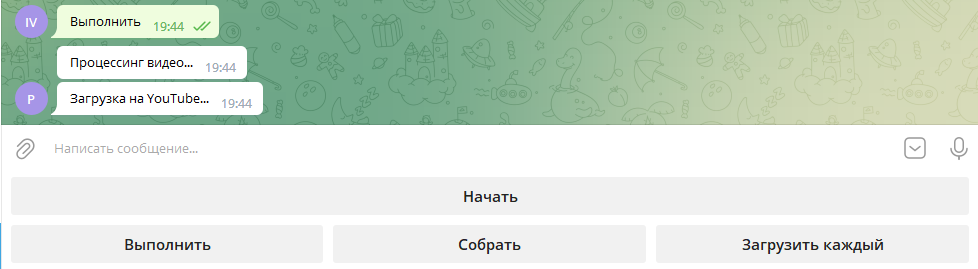

# PublicVideoBot
Telegram бот для процессинга и публикации видео на YouTube.

## Конфигурация

Файл параметров: *tgsettings.ini* 

Раздел [DEFAULT]:

- log_dir = logs - Название директории для логов.
- log_file_name = ./logs/log_print.txt - Путь к файлу с логом.
- tglog = True - Использовать вывод лога в Telegram (True/False)?
- count_exeption = 10 - Количество повторений при отправке сообщения (по умолчанию 10). Иногда сообщения не доставляются с первого раза, поэтому повторения для отправки нужны для надёжности.
- sleep_exeption = 0.1 - Задержка между попытками отправить сообщение в секундах.
- name_group = PublicVideoBot - Название бота в Telegram.
- token - Ваш токен Telegram бота в формате 9999999999:XXXXXXXXXXXXXXXXXXXXXXXXXXXXXXXXXXX.
- data_path = ./data - Директория с данными.
- received_path = ./data/received - Директория для сохранения отправленных через бота видео.
- load_path = ./data/load - Директория для загрузки видео.
- processing_path = ./data/processing - Директория хранения обработанных видео файлов.
- blur = False - Использовать ли эффект blur, если видео не убирается в заданный формат (True/False)?
- resize = False - Изменять ли размер видео под заданный формат (True/False)?
- uploader = playwright - Используемый загрузчик видео. Возможные значения: selenium, bot, api, playwright.
- duration_min = 1.75 - Минимально допустимый размер видео (в секундах).
- geckodriver_path = ./data/geckodriver.exe - Путь к драйверу.
- cookies = ./data/cookies.json - Куки для доступа к аккаунту Google/YouTube.
- profile = ./data/profile - Путь к файлам пользовательского профиля.

Раздел [YOUTUBE]:

- login - Логин Google/YouTube.
- password = Пароль Google/YouTube для доступа приложений.
- description = Family video posting - Описание ко всем видео.
- tags = PublicVideoBot, Family - Теги ко всем видео.
- category = 22 - Категория видео. Подробнее здесь https://developers.google.com/youtube/v3/docs/videoCategories/list.
- policy = 3 - Уровень доступа. 0 - private, 1 - public, 3 - unlisted, 2 - schedule.

## Запуск

Для того, чтобы всё работало необходимо создать бота в Telegram.

Для загрузчика **playwright** необходимо:

1. Зайти в свой аккаунт Google
2. Перейти на сайт https://www.youtube.com/
3. Сохранить куки в файл *./data/cookies.json*
4. При необходимости поменять значение поля *sameSite* на *None*.

Команда для запуска: `python bot.py`

Что необходимо для запуска:

- Конфигурационный файл *tgsettings.ini*:
  - [DEFAULT] token - Ваш токен Telegram бота
  - [YOUTUBE] login - Логин Google/YouTube
  - [YOUTUBE] password - Пароль Google/YouTube для доступа приложений.
- Куки *cookies* для доступа к аккаунту Google/YouTube.
- Файлы *client_secret.json* и *user_token.json* для доступа по API.

## Работа

Обработка видео файлов:

1. Видео, отправленное через бота сохраняется в папке *received_path*, указанной в конфигурационном файле.

2. Видео также можно добавить вручную в папку *load_path*.

3. После процессинга и конкатенации видео попадает в папку *processing_path*.

4. После загрузки на YouTube видео удаляется.

   

Последовательность работы с ботом:

1. Нажимаем на кнопку **"Начать"**. После этого вводим название группы загружаемых видео. Это название будет фигурировать в названии итогового видео на YouTube. Если название не будет задано, используется название по умолчанию, например, .
2. Нажимаем на кнопку **"Собрать"**. Бот собирает оставшиеся видео из папки *load_path*, если они там были.
3. Нажимаем на кнопку **"Выполнить"**. Собранные видео обрабатываются и конкатенируются в единый файл. Если видео имеют разную ориентацию, то итоговых файлов будет 2: с горизонтальной и вертикальной ориентацией. Конкатенация видео происходит в той последовательности, в которой мы отправляли их боту. Далее итоговое видео загружается на YouTube.
4. Нажимаем на кнопку **"Загрузить каждый"**. Собранные видео обрабатываются и загружаются на YouTube как разные файлы (без конкатенации).

